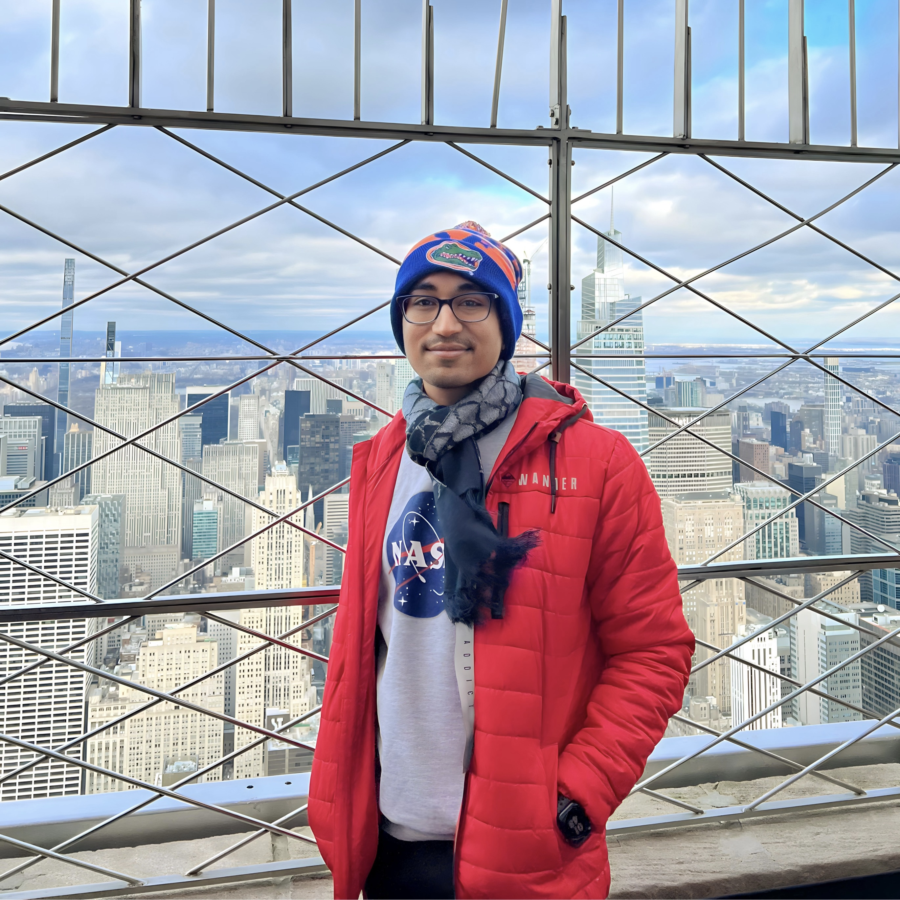

<link rel="stylesheet" href="/assets/css/styles.css">

{: .profile-picture }

## About Me

A short bio about yourself. Enthusiastic developer with a passion for coding and problem-solving.

## Experience

- **Data Scientist** at Elutions Inc - June 2023 - Present
- **Graduate Research Assistant** at University of Florida - July 2022 - May 2023
<!-- Add more experiences as needed -->

## Education

- **MS** in Computer Science from University of Florida, FL, USA - August 2021 - May 2023
- **BTech** in Computer Science & Engineering from Maulana Abul Kalam Azad University of Technology, WB, IND - August 2017 - July 2021
<!-- Add more education details as needed -->

## Skills

- Skill 1
- Skill 2
- Skill 3
<!-- Add more skills as needed -->

## Awards and Achievements

- Herbert Wertheim College of Engineering Achievement Award Scholarship
<!-- Add more awards as needed -->

## News

## News
- [2024-06-01] Yay! 1 year of working as a Data Scientist at Elutions!
- [2023-06-01] Starting a new job as a Data Scientist at Elutions Inc.
- [2023-05-09] Graduated from UF with an M.S. in Computer Science.
- [2021-08-23] Started grad school at the University of Florida.
- [2021-07-22] Graduated from MAKAUT with a B.Tech. in Computer Science & Engineering.
- [2020-08-05] Selected for the Google Research India AI Summer School in the Computer Vision and Machine Perception Track!
<!-- Add more news items as needed -->

